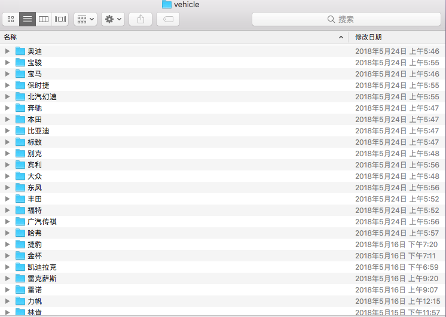
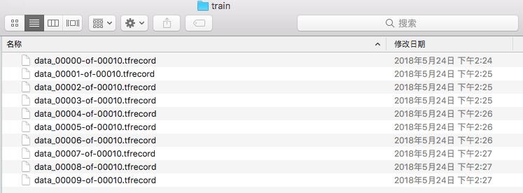

# Vehicle Brand Classification

## 1. 目标

对实时监控系统下的车辆品牌进行分类。

如下图直接得出分类结果为宝马：

### 2. 数据

通过从视频中切割出单个车辆图片，然后进行标注，目前大约标注了几万张图片，但是由于
	
* 高分辨率的监控图片切割为车辆图片后过于模糊，无法标注
* 车辆品牌不均匀，如雪铁龙，大众这类数据量很大，但是如兰博基尼这类样本偏少

所以最终先选择了50个品牌进行训练，每个品牌图片有300张左右，部份不足300张图片的品牌通过网络爬虫爬取对应的车辆图片。

|        | train           | validation  | total  |
| ------------- |:-------------:| :-----:| :-----:|
| number      | 14000 | 1000 | 15000|
| proportion      | 93.33%      |   6.67% | 100.00%|

### 3. 环境
#### IDE
* pycharm
* atom

#### 系统环境
* MacBook Air 进行代码编写
* Ubuntu x86_64 GNU/Linux

### 4. 主要步骤
>	整个分类任务的实现是基于 [tensorflow/models](https://github.com/tensorflow/models/) 下的分类网络
>  本文件夹下的slim对应 [tensorflow/models/tree/master/research/slim](https://github.com/tensorflow/models/tree/master/research/slim) , 针对本次分类任务需要自定义相关代码。
> 

#### 4.1 数据预处理
1. 从视频中分割出对应的车辆图片
2. 将对应的车辆图片进行标注，最终将其分成如下形式, 每一个文件夹包含300张左右对应品牌车辆图片

	

3. 为了使数据适应 TensorFlow 需要将数据转化为TFRecord的形式。数据随机的分为两个部分，分别用来训练和交叉验证

	
	
	对应代码在 [data/gen_dev_and_train_set.py](data/gen_dev_and_train_set.py) 和 [gen_TFRecord.py](data/gen_TFRecord.py)
	
#### 4.2 训练

主要修改 `slim/` 目录下的相关代码，如训练分类器代码`slim/train_image_classifier.py`、启动分类器 `slim/setup.py` 等，具体如何使用`tensorflow/models`中的分类器可以 [点击这里](https://github.com/tensorflow/models/tree/master/research/slim)

#### 4.3 结果
主要使用了 [Inception V4](http://arxiv.org/abs/1602.07261) 和 [Inception-ResNet-v2](http://arxiv.org/abs/1602.07261) 进行训练，在训练时分别使用了pre-trained的checkpoints和从零开始分别进行训练。本以为pre-trained可能会效果更好，从零开始训练的效果更好。

|        | Accuracy           | Recall |
| ------------- |:-------------:| :-----:|
| Inception V4 pre-trained      | 0.424 | 0.693 |
| Inception V4 from scratch      | 0.939 | 0.983 |
| Inception-ResNet-v2 pre-trained      | 0.468      |  0.758 |
| Inception-ResNet-v2 pre-trained      | 0.917      |  0.98 |

### 5. 后期计划
* 丰富数据集，使得车辆品牌数量增加，单个品牌图片数量多
* 自行设计网络结构，先提取特征，再进行分类任务

